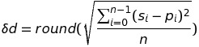

### Peak detection

- [Introduction](#introduction)
- [A few practical points](#a-few-practical-points)
- [The algorithm](#algorithm)
- [Parameters](#parameters)

#### Introduction

In a large dataset of tweets distributed along a temporal axis, it may be of particular interest to investigate time intervals during which an uncommonly large amount of the dataset's tweets were created. These busy intervals might be the result of some event or discuss similar topics. For this reason, an algorithm may be needed to automatically find these potential peaks of interest. Below, a simple example of one such algorithm is presented.

#### A few practical points

- Takes the input data typically as an array containing the amount of positive and negative tweets in a time interval at the specified index.

- Attempts to find all 'peaks of interest' in the input data. Which points that are considered 'peaks of interest' can (to some extent) be adjusted through the algorithm's parameters.

- Treats positive and negative tweets completely separately.

- Is based on two smoothening filters (of whichever sort appears suitable), one stronger than the other, that are applied on the data and upon which important peaks are more easily detected.

- Tries to see the whole picture: The peak detection is based on a smoothening of the original data, which means peaks are detected where the data suddenly trends higher and then lower. This may, in some cases, signify that the units of time considered peaks are not, in fact, particularly crowded ones but they form the center of one such trend. Depending on the smoothening algorithm used, and their parameters, the extent at which this happens in practice can be modified. None the less, it could be considered a disadvantage if what is being looked for is in fact specific highly crowded units of time, rather than an indicator of a rough "hilltop" or "mountain peak" where the unit of time represented by the indicator itself might, occasionally, be significantly less crowded than its neighbours. The parameters should be adjusted in such a way that the time window observed for further computation at each peak houses as many tweets as possible, even if the peak point itself might end up placed in a 'valley'.

- Not necessarily dependent on the entire data: The algorithm itself places no global constraints (such as requiring that peaks be above a certain mean value or percentile) on which local maxima can be considered 'peaks of interest'. This adds a more dynamic aspect to the peak detection. The benefit is that peaks are detected even if the data trends significantly higher in the 'future'. Peaks that were once considered important may, at a later point, seem minor, but this algorithm may still recognize them as peaks. This will not do in situations where absolute peaks are of greater interest than relative peaks. On the other hand, basing the parameters (especially the delta parameter) on some metric on the entire data may provide a balance between absolute and relative. For more information on this, see [parameters](#parameters).

#### The algorithm

__Parameters:__
- `alpha`               (constant)
- `beta`                (constant)
- `delta_pos`           (constant or algorithm)
- `delta_neg`           (constant or algorithm)
- `primary_filter`      (algorithm)
- `secondary_filter`    (algorithm)

A closer description of the parameters can be found under [parameters](#parameters).

__Input:__ The data as an array, mapping each index (corresponding to a time interval) to the amount of positive and negative tweets (respectively) that were created during that interval.

__Output:__ A list of indices that correspond to time intervals that form positive and negative peaks (separately, e.g. one list for each).

__Algorithm steps:__ The following steps describe the algorithm. The exact same algorithm is applied on the positive and the negative data (except that the positive one uses `delta_pos` as the `delta` parameter while the negative one uses `delta_neg`) completely independently of each other.

__1:__ Two smoothening filters* are applied on the data. One is referred to as the primary filter and the other as the secondary filter. The secondary filter needs to be stronger than the primary filter.

__2:__ Every local maximum of the primary filtered data is identified: An array consisting of all adjacent triples (ti-1, t2i, t3i+1) in the data array is iterated through, and wherever ti > ti-1 and ti > t3i+1 (tk being the amount of tweets at the time interval with index k of the primary filtered data), i is a local maximum.
(In the case of plateaus (ti = ti+1 and the trend going down on both sides), one index belonging to the plateau should be considered a local maximum. In case of a plateau of more than two intervals, ideally e.g. the middle index should be considered a local maximum. One simplification is to always pick the leftmost index of a plateau.)

__3:__ The local maxima are candidates for being peaks. They are iterated through and for each peak index i, the value pi (the amount of tweets at index i of the primary filtered data) is compared to the value si (the amount of tweets at index i of the secondary filtered data). If pi >= si + `delta`, i is considered a peak. Otherwise, it is not. Finally, all the indices that were considered peaks are returned (from the positive and the negative data separately).

#### Parameters

__*Smoothening filters:__ The goal of the filters is to create a smoother version of the data (as a function number of tweets / unit of time) in such a way that small peaks and valleys are melted together into an average trend. The stronger the filter, the rougher the average and the smoother the curves. The weaker the filter, the more precisely the filtered graph follows the original graph. In this case, the algorithm uses different types of moving average as the filters, even though potentially any type of smoothening filter could be used. Moving average is based on a fixed-sized sliding window that iterates through all the windows in the array from [t0, ..., _wnd_-1] to [t_n_-_wnd_, ..., _n_-1], where _wnd_ is the size of the smoothening window and _n_ is the number of elements in the data. For each one of these ranges of size _wnd_, an average is calculated and the array of all these average values forms the new, filtered array. (Since the filtered array needs to be of the same size as the original array, the original array is padded with e.g. zero values, floor(wnd/2) in the beginning and the end, so that the amount of windows will equal the amount of elements in the original array.)

The _average_ used by a moving average filter can be of arbitrary kind. Below, three such filters are presented as functions `T(k,α)`, where `k` denotes the index for which we are calculating a new 'filtered' value and `α` denotes the α (for the primary filter) or β (for the secondary filter) parameter of the algorithm (the window size of the moving average algorithm being α * 2 + 1). The below three suggestions are only examples _(The formulae are drafted and not verified; may contain errors!)_:

Plain average:
[//]: <> (T1(k, a) = sumi=k-a to k+a(f(i)) / (2a + 1))

Arithmetically weighted average:
[//]: <> (T2(k, a) = sumi=k-a to k+a(f(i) \* (a + 1 - |k - i|)) / (a + 1)²)

Polynomially weighted average (2nd degree):
[//]: <> (T3(k, a) = sumi=k-a to k+a(f(i) \* (a - |i - k| + 1)²) \* 3 / (2a³ + 6a² + 7a + 3))

__Delta:__ The delta parameter defines the threshold of the difference between the primary and secondary filter, at which local maxima are considered 'peaks of interest'. The parameter is given separately for the positive and the negative graphs, as `delta_pos` and `delta_neg`. The higher the delta value, the more pronounced the peaks need to be. The parameter can either be a constant, in which case different parts of the graph will be completely separate in the eyes of the peak detection, or it can be calculated with a formula, as some metric of the dataset. One such example is presented below; an experimental metric for deciding a decent delta value based on how aggressively the data fluctuates. This places a certain dependence on the data, leading to very large and steep peaks 'overshadowing' smaller ones even if not immediately adjacent. This, in turn, can be ideal in occasions where the peak detection is applied on limited time intervals at a time, e.g. daily.

Square mean delta metric (DeltaDev):
- Square mean of difference between the primary filtered values and the secondary filtered values
- 
- Can (and should) be calculated separately for positive and negative tweets to yield better adapted values
- Adapts the delta threshold to the current data automatically in an attempt to make the amount of peaks detected less dependent on the fluctuation of the data

__All parameters:__

| Name  | Type  | Description | Function |
| --- |---|---|---|
| `alpha`  | constant  | Defines the roughness of the primary filter (bigger is rougher)  | The size of the sliding window of the primary filter is defined by wnd = 2*alpha+1. By definition, alpha < beta. |
| `beta`  | constant  | Defines the roughness of the secondary filter (bigger is rougher)  | The size of the sliding window of the secondary filter is defined by wnd = 2*beta+1. By definition, alpha < beta. |
| `delta_pos`  | constant or function  | Defines a sort of threshold for positive local maxima to be considered peaks. | If pi is a local maxima and pi >= si + `delta_pos`, then _i_ is considered a peak. Otherwise, it is not. |
| `delta_neg`  | constant or function  | Defines a sort of threshold for negative local maxima to be considered peaks. | If pi is a local maxima and pi >= si + `delta_neg`, then _i_ is considered a peak. Otherwise, it is not. |
| `primary_filter`  | function  | Defines the type of average used by the moving average-type filter of the primary filter. | Takes as input an array of integers (tweets per unit of time belonging to the same window; the middle value being the value that will be replaced with the average) and applies a function on them, returning an integer that is the smoothened value of that point, based on the neighbours. |
| `secondary_filter`  | function  | Defines the type of average used by the moving average-type filter of the secondary filter. | Takes as input an array of integers (tweets per unit of time belonging to the same window; the middle value being the value that will be replaced with the average) and applies a function on them, returning an integer that is the smoothened value of that point, based on the neighbours. |
