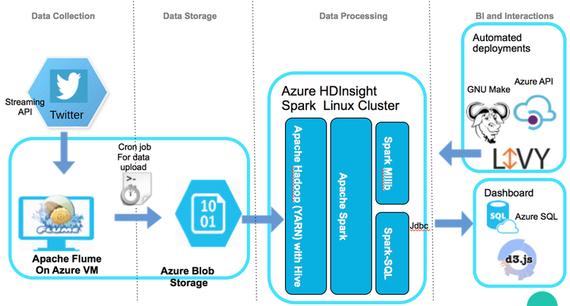

### Twitter Opinion Mining using Azure Hdinsight Spark (Linux)

An Apache Spark application to analyse raw Twitter data and provide the following features:

- Hourly Sentiment classification (with Logistic Regression and sentiment140 training data) on a timeline.
- Automatic Peak Detection for hourly positive and negative sentiments.
- Topic modelling (LDA) over the positive and negative peaks.
- Top hashtags during the positive and negative peaks.
- Backtrack the tweets that contribute highly to the topics.

Together, these features can be used to find the Public Opinion swing over the time to measure the performance of campaigns such as marketing, political or public awareness campaigns. We also provide a basic level of d3.js based interactive dashboard that visualises the provided insights.

We use Microsoft Azure services to deploy this application. However, with few configuration changes, it can be deployed to other cloud services such as Amazon Web Service (AWS), Google Cloud Platform.

**Requirements:**

1. Azure account with a valid subscription.
2. Azure Command-line interface installation. Please refer to [Azure-cli installation tutorial](https://databricks.com/blog/2015/09/22/large-scale-topic-modeling-improvements-to-lda-on-apache-spark.html)
3. Azure storage account. Please refer to [Azure storage account management tutorial](https://Azure.microsoft.com/en-us/documentation/articles/storage-create-storage-account/).
4. Azure resource group
5. Git and project git repository `git clone https://github.com/Software-Development-Pakistan/twitter-opinion-mining`
6. MacOS / Centos / Ubuntu with Scala 2.10.4, SBT (v 0.13.9 +) and Java 7 or 8
7. GNU Make utility.
8. Apache web server for hosting d3js dashboard.

**Deployment Architecture**




**Azure Environment Setup**

* Login to [Azure Portal](https://portal.Azure.com) using a terminal.
* Export environment variables for Azure API. Edit the ./conf/hdinsight_setup_config.sh file and source it with the following command in the terminal. Please read the instruction in the script. We have given some examples values except the password and keys.
      `source ./conf/hdinsight-spark-env.sh`


* Provided that you already have an Azure storage account, create following four blob containers with container level access. You can change the name of containers as per your choice, but you need to modify the configuration file (./src/main/resources/config.json) inside project root directory. By default following, folders are configured.
    - ***ms-tweets-daily*** for storing daily raw tweets. The corresponding config entry in config.json is input.tweets. You can modify it according to your requirements.
    - ***sentiment-training*** for storing [sentiment 140 training data](http://help.sentiment140.com/for-students/). The corresponding config entry in config.json is input.trainingData. Training data is available in ./data/twitter_training.csv.tar.gz. Uncompress it before uploading to blob storage.
    - ***sentiment-stopwords*** for storing English language stopwords. The corresponding config entry in config.json is input.stopwords. Stopwords list is available in ./data/stopwords.txt. Upload it to blob storage.
    - ***sentiment-output*** for storing output file in the CSV format. Although we store preprocessed data in an Azure SQL DB, we also write an output file in Blob storage. The spark job will rewrite this file on execution. The corresponding config entry in config.json is output.csvOutputPath.
* Create an SQL Database. You need to provide user specific setting i.e. username, password, etc. After the creation, you can see that there is another SQL server resource available along with the SQL DB. In SQL server resource you can control the firewall setting to allow clients to access the DB. Use any SQL Client, e.g. SQL Pro for MSSQL, to connect to DB using the connection information available on Azure portal. Create a DB and table for the output with the following schema. The DB settings should be used in the config.json file.

| ***Column Name*** | ***Type***     |*** Size*** |
|-------------|----------|------|
| hour        | varchar | 50   |
| sentiment   | varchar | 25    |
| tweets      | int      |      |
| topics      | varchar | 500  |
| sampleTweets   | varchar | 1000  |
| hashtags    | varchar | 250  |

* copy the ./web folder to apache web root (e.g. /var/www/html/ as default for centos). Your dashboard should be available on https://<Apache Server Public IP>/web/ . You need to configure Azure SQL DB connection parameters in ./web/data.php

**To execute code**

1. Login to Azure using Azure-cli

2. Change to application directory with

   `cd twitteropinionmining`

3. Review spark applications configuration parameters in  ./src/main/resources/config.json file and also Azure spark cluster information in ./Makefile. Change the configurations accordingly.

4. Execute the following commands:

  * create Azure cluster by

  `make cluster`

  * update and build the code

  `make build`

  * launch spark app with livy

  `make submit`

  * destroy the cluster

  `make cleanup`

**Visualisation Dashboard**

The web-based dashboard comes configured to load its data from an SQL database, but it can be reconfigured to load the data in various ways. The `index.html` file contains the visualisation tool itself and it expects data of a compatible type. Edit the values of the variables `DATA_URL` and `inputType` to change the location the data is loaded from and the data format to be expected. Currently, the tool supports CSV and JSON formats. The variable `DATA_URL` must be a URL at which the data can be found. If this data is located on a different domain, the client may need to enable CORS to access this data. For accessing data of some other type, first, convert it to one of these. E.g. to access the data from an SQL database (as in the default configuration), call the `data.php` file after having configured it by editing its variables to access the database.

To illustrate, three examples are presented below:

1. The data is in a local CSV file `data.csv`, located at the relative path `data/data.csv` in respect to the `index.html` file itself:
```javascript
var DATA_URL = "data/data.csv";
var inputType = "csv";
```

2. The data is available at an external SQL database:
```javascript
var DATA_URL = "data.php";
var inputType = "json";
```
where the `data.php` is configured to access the database (the file is in charge of loading the data from the SQL server and returning it as JSON).

3. The data is publicly available as a CSV file in Azure Blob storage:
```javascript
var DATA_URL = "https://<accountname>.blob.core.windows.net/<filepath>";
var inputType = "csv";
```
in which case the client may need to explicitly allow accessing the resource at this origin.


*Key files and folders in the source code***

    *Configuration files
        * ./conf/hdinsight-spark-env.sh  : Environment variables for Makefile to create Azure HDInsight cluster, Build the fat jar with sbt assembly, Submit spark job to the cluster using Livy job server, and finally clean up the cluster in the end.
        * ./src/main/resources/config.json  : Spark application related configuration parameters.

    *Spark Scala Application code:
        * ./src/main/scala/TwitterOpinionMining.scala

    * SBT Build definition files
        * ./TwitterOpinionMining.sbt : Build settings with spark application dependencies to include.
        * ./project/assembly.sbt  : SBT assembly file to generate one fat jar.


    * Data file in ./data folder. It includes stopwords, sentiment training data, sample tweets, and sample output files.
    * D3JS Web app for the dashboard in the ./web folder.
    * ./Makefile for automated deployment, execution and cleanup.


**Data collection with flume is not the part of this document***

Please refer to [Cloudera Twitter tutorial](https://github.com/cloudera/cdh-twitter-example).
